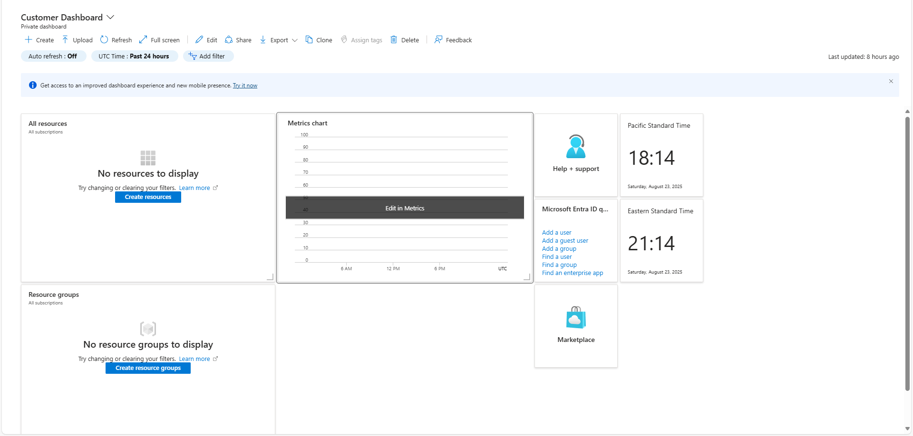

# Creating a Dashboard in Azure

## Goal
Practice customizing dashboards in the Azure portal to monitor and organize resources effectively.

## What I Built
- A custom **Customer Dashboard** with multiple tiles (Clocks, All Resources, Resource Groups, Metrics, etc.).
- A cloned **Microsoft Entra Admin Dashboard** with user-focused tiles.

## Steps I Followed
1. Created a new custom dashboard.  
2. Renamed it to **Customer Dashboard**.  
3. Added and configured the first **Clock tile**.  
4. Added additional tiles (All resources, Resource groups, Metrics, Help + Support, Entra quick tasks, Marketplace).  
5. Cloned the dashboard into a new **Microsoft Entra Admin Dashboard** and customized it with user-related tiles.  

## Screenshots

1. Creating the new custom dashboard  
   

2. Renaming the dashboard to “Customer Dashboard”  
   

3. Adding the first clock tile  
   

4. Final Customer Dashboard with multiple tiles  
   

5. Cloning into Microsoft Entra Admin Dashboard  
   

## Notes / Gotchas
- Cloning dashboards is useful when creating variations for different roles (e.g., customers vs. admins).
