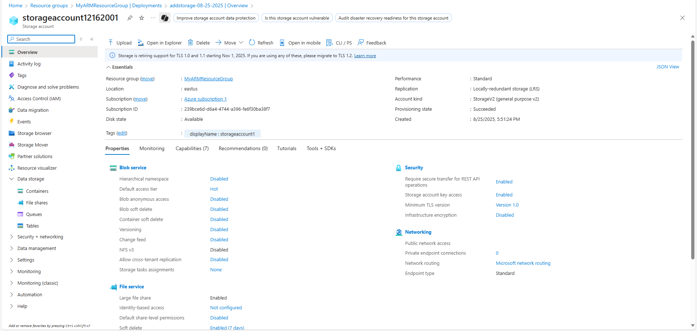

# 🚀 Azure ARM Template Deployment – Storage Account

This project demonstrates how to create and deploy an **Azure Resource Manager (ARM) template** using **Visual Studio Code** and **Azure PowerShell**.  
The deployment provisions a **Resource Group** and a **Storage Account** in Azure.

---

## 📑 Table of Contents
- [Overview](#-overview)
- [Screenshots Walkthrough](#-screenshots-walkthrough)
  1. [Blank ARM Template](#1-blank-arm-template)
  2. [Connect to Azure](#2-connect-to-azure)
  3. [View Subscription](#3-view-subscription)
  4. [Create Resource Group](#4-create-resource-group)
  5. [Resource Group Provisioned](#5-resource-group-provisioned)
  6. [Azure Portal Verification](#6-azure-portal-verification)
  7. [Edit ARM Template](#7-edit-arm-template)
  8. [Update SKU](#8-update-sku)
  9. [Deploy Template Again](#9-deploy-template-again)
  10. [Deployment Success – Storage](#10-deployment-success--storage)
  11. [Storage Account Resource](#11-storage-account-resource)
- [Tools & Technologies](#-tools--technologies-used)
- [Learning Outcomes](#-learning-outcomes)
- [Cleanup Instructions](#%EF%B8%8F-cleanup-optional)
- [Outcome](#-outcome)

---

## 📖 Overview
This project is part of my **Azure Projects Portfolio**.  
The goal is to:
1. Write an ARM template in **VS Code**
2. Deploy it via **Azure PowerShell**
3. Verify the results in the **Azure Portal**

---

## 📸 Screenshots Walkthrough

### 1. Blank ARM Template
Starting point: an empty `azuredeploy.json` ARM template in VS Code.  


---

### 2. Connect to Azure
Logged into Azure using PowerShell (`Connect-AzAccount`).  


---

### 3. View Subscription
Verified available subscriptions with `Get-AzSubscription`.  


---

### 4. Create Resource Group
Created a new resource group using `New-AzResourceGroup`.  


---

### 5. Resource Group Provisioned
Confirmed the new resource group provisioned successfully.  


---

### 6. Azure Portal Verification
Checked the deployment in the Azure Portal – resource group visible.  


---

### 7. Edit ARM Template
Added a Storage Account resource definition to the ARM template.  


---

### 8. Update SKU
Modified SKU from **Premium_LRS** to **Standard_LRS** to stay within free tier.  


---

### 9. Deploy Template Again
Redeployed the updated template, resulting in **two deployments** (blank + storage).  


---

### 10. Deployment Success – Storage
Verified the second deployment (`addstorage`) completed successfully.  


---

### 11. Storage Account Resource
Confirmed the storage account resource was created inside the resource group.  


---

## 🛠 Tools & Technologies Used
- **Azure Resource Manager (ARM) Templates**
- **Visual Studio Code**
- **Azure PowerShell**
- **Azure Portal**

---

## 🎯 Learning Outcomes
Through this project, I practiced:
- Writing and editing **ARM templates** in JSON
- Using **PowerShell commands** (`Connect-AzAccount`, `New-AzResourceGroup`, `New-AzResourceGroupDeployment`)
- Deploying infrastructure as code (IaC) into Azure
- Validating deployments through the **Azure Portal**
- Managing costs with **Standard_LRS** free tier resources
- Documenting projects with **GitHub READMEs**

---

## ⚠️ Cleanup (Optional)
To avoid any charges, delete the resource group when done:

```powershell
Remove-AzResourceGroup -Name MyARMResourceGroup -Force
